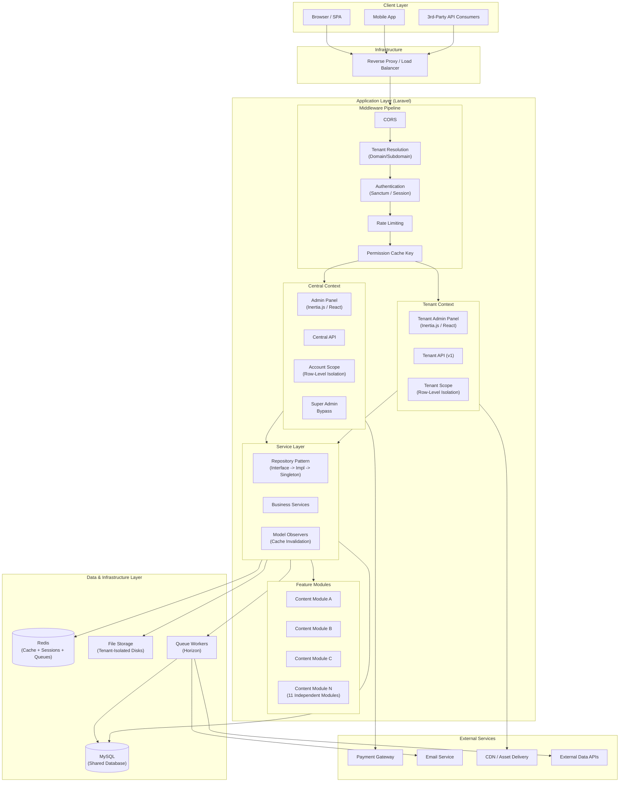
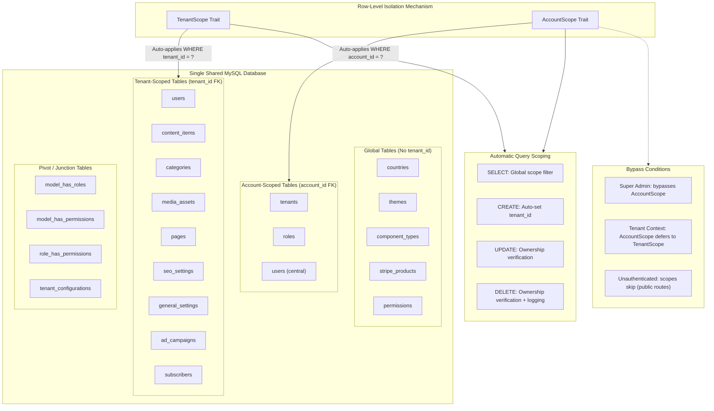

# Enterprise Multi-Tenant SaaS Platform

A large-scale **enterprise multi-tenant SaaS platform** built for content management and publishing workflows.  
This repository documents the **architecture, system design, and technical decisions** of a real-world production system.

> ⚠️ **Confidentiality Notice**  
> Source code, internal documentation, and screenshots are intentionally excluded to respect company confidentiality.  
> This repository focuses on architecture, scalability strategies, and engineering practices.

---

## Project Context

- This project was **already in development** when I joined.
- I entered during the **mid-phase of development**.
- Over time, I took ownership of core modules and later **led the project as a Team Lead**.
- My role involved **stabilizing the system, scaling it, and guiding architectural decisions**.

---

## My Role & Responsibilities

**Team Lead / Full-Stack Developer**

- Led backend and frontend development efforts
- Designed and improved **multi-tenant architecture**
- Implemented **tenant isolation strategies**
- Optimized performance for high-traffic scenarios
- Reviewed code, mentored developers, and guided best practices
- Collaborated with product, QA, and DevOps teams
- Ensured security, scalability, and maintainability

---

## System Overview

The platform supports multiple organizations (tenants) on a shared infrastructure while ensuring strict data isolation and scalability.

**Key Characteristics:**
- Enterprise-grade SaaS
- Multi-tenant architecture
- Role-based access control
- Subscription-based business model
- High availability and performance focus

---

## Architecture Highlights

- **Tenant Identification**
  - Domain-based and/or request-based tenant resolution
- **Data Isolation**
  - Tenant-aware queries and scoped access
- **Authentication & Authorization**
  - Centralized auth with tenant context
- **Scalability**
  - Designed to support thousands of tenants
- **Security**
  - Strong access boundaries between tenants
 
  > Diagrams reflect the real production system. Source code is confidential.

---

### System Architecture

### Shared Database Multi-Tenancy Model

📁 **More diagrams:** [Request Lifecycle](./docs/request-lifecycle.md) · [Auth Flow](./docs/auth-flow.md) · [Database Schema](./docs/database-schema.md) · [Modular Architecture](./docs/modular-architecture.md)

## Tech Stack

### Backend
- Laravel
- PHP
- MySQL
- REST APIs
- Queue & background job processing

### Frontend
- React / Next.js
- Component-driven architecture
- API-driven UI

### Infrastructure & DevOps
- Docker
- Docker Compose
- CI/CD pipelines
- Cloud-based deployment (AWS / similar)

---

## Key Engineering Contributions

- Improved multi-tenant request lifecycle
- Refactored legacy modules for maintainability
- Introduced performance optimizations
- Defined coding standards and review processes
- Assisted in production debugging and incident resolution

---

## Why This Repository Exists

Many impactful engineering projects cannot be open-sourced.  
This repository exists to demonstrate:

- Real-world **SaaS architecture experience**
- Leadership in an **enterprise environment**
- Ability to work on **large, long-running systems**
- Strong understanding of **scalability, security, and system design**

📁 Detailed technical documentation is available here: [/docs](./docs)
---

## Related Public Links

- 🌐 Product Website (Public Frontend): https://www.ipublisher.app
- 👤 Author: Ali Hamza  
- 💼 Role: Team Lead / Full-Stack Developer

---

## License

No license is provided, as this repository does not contain distributable source code.

---

## Contact

If you’re a recruiter or hiring manager and would like to discuss the architecture, challenges, or decisions in more detail, feel free to reach out via:

- GitHub: https://github.com/alihamzahq
- Website: https://alihamza.dev
