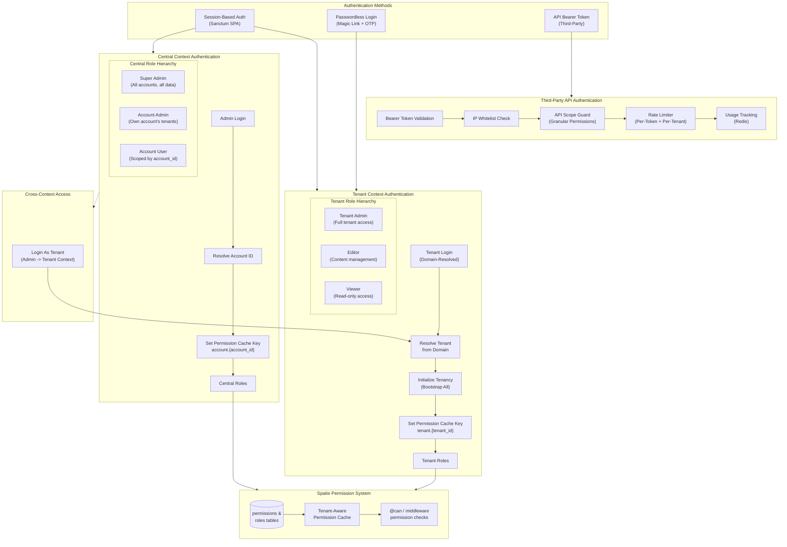

# Authentication & Authorization Flow

The platform supports dual authentication contexts: **central** (admin panel with account-based isolation) and **tenant** (tenant admin panel with tenant-scoped permissions). Authentication uses session-based auth with Sanctum for SPA, plus passwordless login via magic links and OTP codes. Authorization leverages Spatie Permission with tenant-aware cache keys to prevent cross-tenant permission leakage. Third-party API access uses bearer token authentication with IP whitelisting and usage-tracked rate limiting.

## Authentication Methods

1. **Session-Based (Sanctum SPA)** - Standard email/password login for admin panels
2. **Passwordless Login** - Magic link via email + OTP verification code (tenant context)
3. **API Bearer Token** - For third-party integrations with per-token scope restrictions

## Diagram

## Permission Cache Isolation

The platform uses context-specific permission cache keys to prevent cross-tenant permission leakage:

| Context | Cache Key Pattern | Set By |
|---------|------------------|--------|
| **Tenant** | `spatie.permission.cache.tenant.{tenant_id}` | `TenancyBootstrapped` event listener |
| **Account User** | `spatie.permission.cache.account.{account_id}` | `SetPermissionCacheKey` middleware |
| **Super Admin** | `spatie.permission.cache.account.global` | `SetPermissionCacheKey` middleware |

## API Protection Layers

Third-party API requests pass through 4 middleware layers:

| Layer | Middleware | Behavior |
|-------|-----------|----------|
| 1 | `ApiTokenAuth` | Validates bearer token, identifies tenant (401 if invalid) |
| 2 | `ApiIpWhitelist` | Checks request IP against token's allowed IPs (403 if blocked) |
| 3 | `ApiRateLimiter` | Enforces per-token (6000/min) and per-tenant (20000/min) limits (429 if exceeded) |
| 4 | `ApiUsageTracker` | Records usage metrics in Redis for billing/analytics |

## First-Party API Protection

Tenant frontend apps use a separate middleware group:

| Layer | Middleware | Behavior |
|-------|-----------|----------|
| 1 | `FirstPartyCors` | Only allows requests from tenant's `frontend_domain` + localhost |
| 2 | `FirstPartyRateLimiter` | 60 requests/min per route per tenant |
