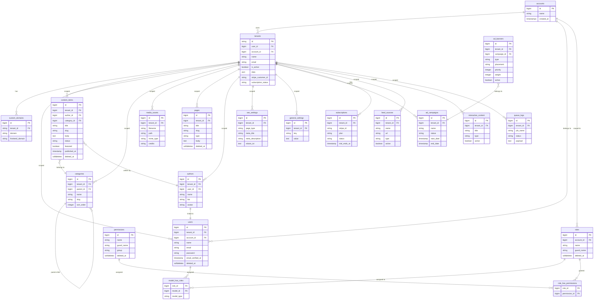

# Database Schema (Anonymized ERD)

This ERD shows the core tables and their relationships in the shared database. Tables with `tenant_id` are tenant-scoped (row-level isolation via TenantScope trait), tables with `account_id` are account-scoped (central administration isolation via AccountScope trait), and tables without either are global/shared across all tenants. The schema supports multi-tenant content management, role-based access control, subscription billing, ad campaign management, and modular feature extensions.

## Table Classification

- **Global Tables**: `permissions`, `countries`, `themes`, `component_types`, `stripe_products` -- shared reference data, no tenant/account scoping
- **Account-Scoped Tables**: `tenants`, `roles`, `users (central)` -- isolated by `account_id` for central administration
- **Tenant-Scoped Tables**: `content_items`, `categories`, `media_assets`, `pages`, `authors`, `seo_settings`, `general_settings`, `ad_campaigns`, `ad_banners`, `subscriptions`, `feed_sources`, `subscribers`, `interactive_content`, `queue_logs` -- isolated by `tenant_id`

## Diagram

## Key Schema Patterns

| Pattern | Implementation |
|---------|---------------|
| **Row-level isolation** | `tenant_id` FK on all tenant-scoped tables, enforced by TenantScope trait |
| **Account isolation** | `account_id` FK on central tables, enforced by AccountScope trait |
| **Soft deletes** | Used on `users`, `content_items`, `pages`, `roles`, `permissions` |
| **Polymorphic roles** | `model_has_roles.model_type` allows roles on any model type |
| **Self-referencing** | `categories.parent_id` for nested category hierarchies |
| **Priority + weight** | `ad_banners` uses priority/weight columns for weighted random rotation |
| **JSON data** | `tenants.data` stores tenant-specific configuration as JSON |
