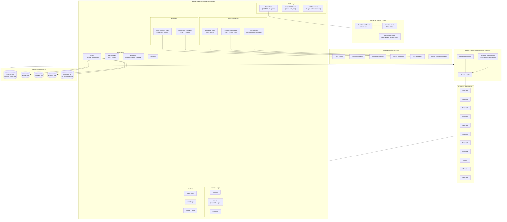
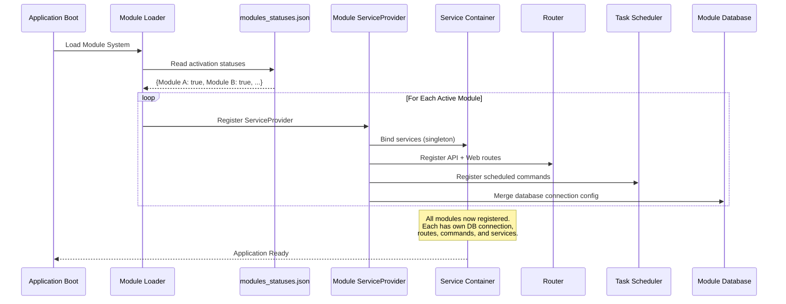

# Modular Architecture (Feature Modules)

The platform uses nWidart/Laravel-Modules to organize domain-specific features into 11 fully self-contained modules. Each module is a mini-Laravel application with its own Models, Controllers, Repositories, Services, Console Commands, Jobs, Migrations, Routes, and even its own dedicated database connection. Modules are hot-pluggable via a JSON activation file -- tenants can be configured to access specific modules, enforced by middleware. The core app provides shared infrastructure (tenancy, auth, caching) while modules handle domain-specific logic independently.

## Why Modular Architecture?

- **Separation of Concerns**: Each domain feature is fully isolated with its own MVC stack
- **Independent Databases**: Each module connects to its own dedicated database, preventing data coupling
- **Hot-Pluggable**: Modules can be enabled/disabled at runtime via `modules_statuses.json`
- **Per-Tenant Access Control**: Middleware enforces which tenants can access which modules
- **Independent Scaling**: Modules can be developed, tested, and deployed independently
- **Scheduled Autonomy**: Each module registers its own cron-based tasks (data fetching, sync, etc.)

## Architecture Diagram



## Module Lifecycle

This sequence diagram shows how modules are discovered, loaded, and registered during application boot.



## Module Internal Composition (Typical Module)

Each module follows a consistent structure that mirrors a full Laravel application:

| Component | Count (Typical) | Purpose |
|-----------|-----------------|---------|
| **Models** | 30-60 | Domain entities with dedicated DB connection |
| **Controllers** | 10-15 | REST API endpoints |
| **Repositories** | 5-10 | Data access abstraction |
| **Services** | 2-5 | Business logic |
| **Console Commands** | 10-20 | Data fetching, synchronization, maintenance |
| **Queued Jobs** | 5-10 | Async background processing |
| **Traits** | 5-15 | Reusable logic (caching, data transformation) |
| **API Resources** | 3-8 | Response transformation |
| **Migrations** | 30-50 | Module-specific database schema |
| **Scheduled Tasks** | 10-15 | Cron-based data sync (every few seconds to daily) |

## Database Isolation

Each module connects to its own dedicated MySQL database:

```
Core App  -->  shared_database     (tenants, users, content, settings)
Module A  -->  module_a_database   (module A domain data)
Module B  -->  module_b_database   (module B domain data)
Module C  -->  module_c_database   (module C domain data)
...
Module K  -->  module_k_database   (module K domain data)
```

Models within each module extend a `BaseModel` that sets the database connection:

```
BaseModel.__construct() --> $this->connection = config('app.DB_CONNECTION_MODULE_X')
```

This ensures all queries from a module automatically use the correct database without explicit connection specification in each query.

## Access Control Flow

```
HTTP Request
  --> Tenant Resolution (domain-based)
  --> CheckTenantModule Middleware (does tenant have access to this module?)
  --> API Scope Guard (does the API token have module:read or module:write scope?)
  --> Module Controller
  --> Module Repository (queries module's dedicated database)
  --> Response
```

## Key Design Patterns

1. **Module Registration via module.json**: Each module declares its service providers, allowing the framework to auto-discover and register them
2. **Dedicated Database Connections**: Prevents data coupling between modules and the core app
3. **Self-Contained Scheduling**: Each module's ServiceProvider registers its own scheduled tasks in the `schedule()` method
4. **API Scope Protection**: Module API routes are protected by granular OAuth-style scopes (e.g., `module:read`, `module:write`)
5. **Singleton Services**: Business services are registered as singletons for performance
6. **BaseModel Pattern**: All module models extend a BaseModel that auto-configures the database connection
