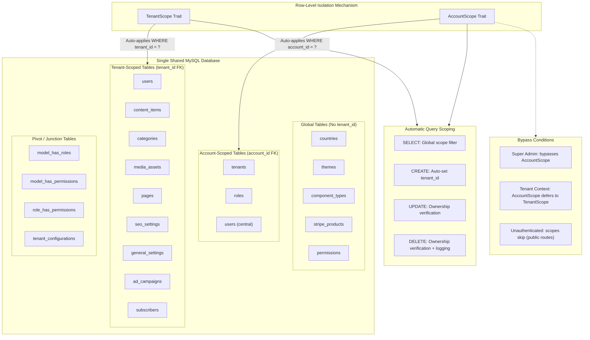

# Shared Database Multi-Tenancy Model

The platform uses a single shared MySQL database with row-level tenant isolation. Two complementary Eloquent scope traits enforce data boundaries: **TenantScope** (for tenant-context operations using `tenant_id`) and **AccountScope** (for central-context operations using `account_id`). Global scopes are automatically applied on all CRUD operations, with security logging for unauthorized cross-tenant access attempts.

## How It Works

1. **TenantScope Trait** - Applied to models that need tenant isolation
   - `SELECT`: Adds `WHERE tenant_id = ?` via a global scope
   - `CREATE`: Auto-sets `tenant_id` to the current tenant
   - `UPDATE/DELETE`: Verifies ownership, aborts with 403 + logs if mismatched

2. **AccountScope Trait** - Applied to models in the central context
   - Same CRUD protections but scoped by `account_id`
   - Bypassed when in tenant context (TenantScope takes priority)
   - Super-admin role bypasses all account filtering

3. **Column Check Caching** - Both traits cache `Schema::hasColumn()` results per-request to avoid repeated information_schema queries

## Diagram

## Isolation Guarantees

| Operation | TenantScope Behavior | AccountScope Behavior |
|-----------|---------------------|----------------------|
| **SELECT** | Adds `WHERE tenant_id = ?` | Adds `WHERE account_id = ?` |
| **CREATE** | Auto-assigns `tenant_id` | Auto-assigns `account_id` |
| **UPDATE** | Verifies `tenant_id` matches, 403 if not | Verifies `account_id` matches, 403 if not |
| **DELETE** | Verifies `tenant_id` matches, logs + 403 | Verifies `account_id` matches, logs + 403 |
| **Super Admin** | N/A (always in tenant context) | Bypasses all filtering |
| **No Auth** | Skips (public routes) | Skips (public routes) |

## Security Measures

- **Unauthorized access logging**: All cross-tenant access attempts are logged with model class, model ID, and both the attacker's and owner's tenant IDs
- **Immediate abort**: Unauthorized access results in an immediate 403 response
- **No lazy loading escape**: Global scopes apply to all query methods including relationships
- **Column cache**: `Schema::hasColumn()` results are cached per-table per-request to prevent performance degradation
