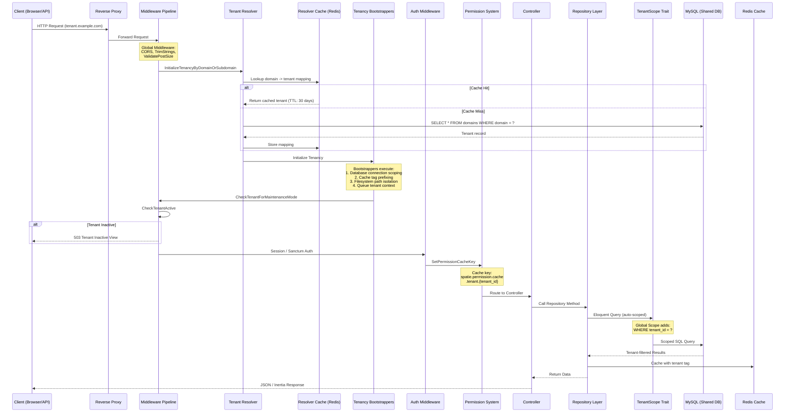

# Request Lifecycle / Tenant Resolution Flow

Every incoming request passes through a middleware pipeline that resolves the tenant from the domain/subdomain, initializes the tenant context (scoping database queries, cache tags, filesystem paths, and queue prefixes), verifies the tenant is active, and then hands off to the authentication and authorization layer. The tenant context propagates automatically to all downstream services via Laravel's service container.

## Key Design Decisions

- **Domain-based resolution** with 30-day Redis caching eliminates repeated DB lookups
- **Tenancy bootstrappers** scope 4 subsystems simultaneously: database, cache, filesystem, queues
- **Permission cache keys** are tenant-specific to prevent cross-tenant permission leakage
- **Tenant resolution middleware** is given highest priority in the middleware stack

## Diagram

## Middleware Pipeline Order

| Order | Middleware | Purpose |
|-------|-----------|---------|
| 1 | `TrustProxies` | Handle proxy headers |
| 2 | `HandleCors` | CORS headers |
| 3 | `PreventRequestsDuringMaintenance` | Maintenance mode check |
| 4 | `ValidatePostSize` | Request size limits |
| 5 | `TrimStrings` | Input sanitization |
| 6 | **`InitializeTenancyByDomainOrSubdomain`** | **Tenant resolution (highest priority)** |
| 7 | `PreventAccessFromCentralDomains` | Block central domain in tenant routes |
| 8 | `CheckTenantForMaintenanceMode` | Per-tenant maintenance mode |
| 9 | `CheckTenantActive` | Verify tenant is enabled |
| 10 | `EncryptCookies` / `StartSession` | Session management |
| 11 | `VerifyCsrfToken` | CSRF protection |
| 12 | `HandleInertiaRequests` | Inertia.js shared data |
| 13 | `SetPermissionCacheKey` | Tenant-aware permission caching |
| 14 | `auth` | Authentication check |

## Bootstrapped Subsystems

When tenancy is initialized, these bootstrappers configure the application for the current tenant:

1. **DatabaseTenancyBootstrapper** - Switches the database connection to include tenant context
2. **CacheTenancyBootstrapper** - Prefixes all cache keys with `tenant_{id}` tag
3. **FilesystemTenancyBootstrapper** - Redirects storage paths to tenant-specific directories
4. **QueueTenancyBootstrapper** - Ensures queued jobs retain tenant context when processed
