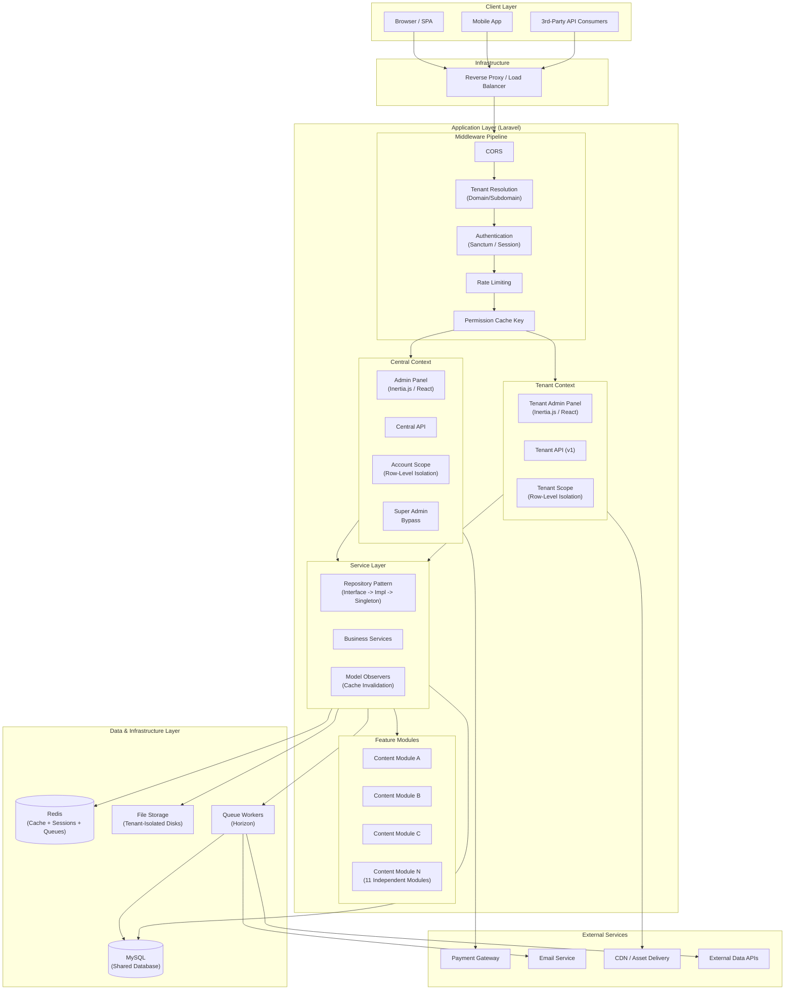

# High-Level System Architecture

The platform follows a layered architecture with clear separation between the central administration layer and tenant-scoped operations. Domain-based tenant resolution routes each request into the correct context, where all downstream services (database queries, cache tags, filesystem paths, and queue prefixes) operate within tenant boundaries. The modular design allows independent feature modules to be composed per-tenant.

## Key Architectural Decisions

- **Inertia.js + React** for the frontend provides SPA-like UX without a separate API for the admin panel
- **Repository Pattern** with interface bindings (singleton) ensures testability and consistent data access
- **Model Observers** handle cache invalidation automatically when data changes
- **11 Independent Feature Modules** (nWidart/Laravel-Modules) allow per-tenant feature composition
- **Dual API layers**: First-party API (CORS-restricted, for tenant frontends) and Third-party API (token-authenticated, rate-limited)

## Diagram

## Component Responsibilities

| Component | Responsibility |
|-----------|---------------|
| **Reverse Proxy** | SSL termination, load balancing, domain routing |
| **Middleware Pipeline** | CORS, tenant resolution, auth, rate limiting, permission cache setup |
| **Central Context** | Super-admin operations, account management, tenant provisioning |
| **Tenant Context** | Tenant-scoped admin panel, content management, settings |
| **Repository Layer** | Data access abstraction via interface -> implementation -> singleton binding |
| **Feature Modules** | Self-contained modules with own models, controllers, migrations, routes |
| **Redis** | Cache (tag-based, tenant-prefixed), sessions, queue backend |
| **Horizon** | Queue monitoring and management with tenant-aware job dispatching |
